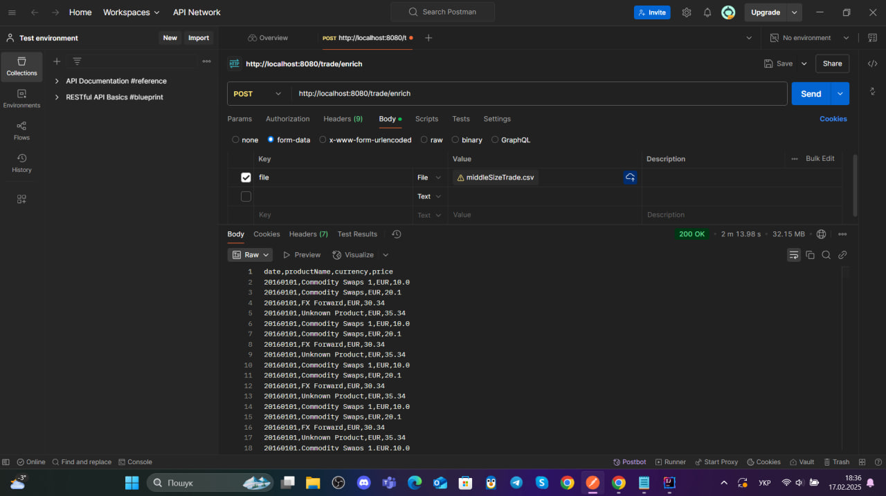
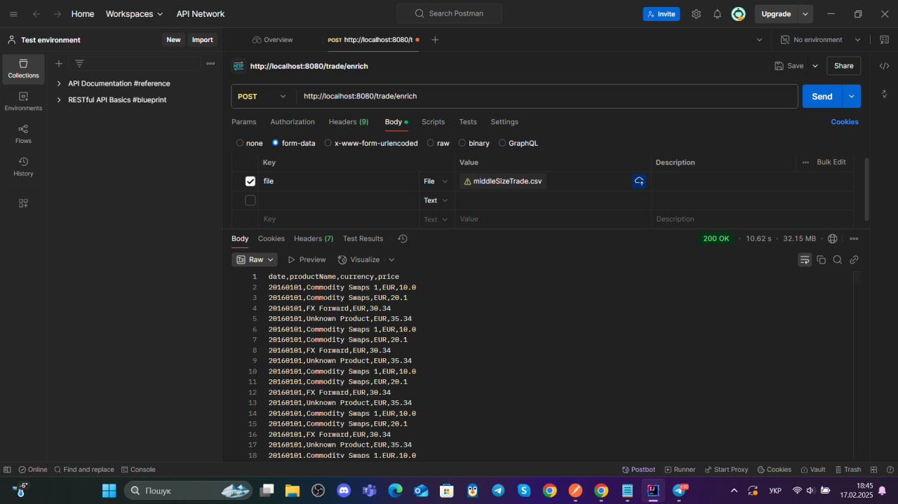
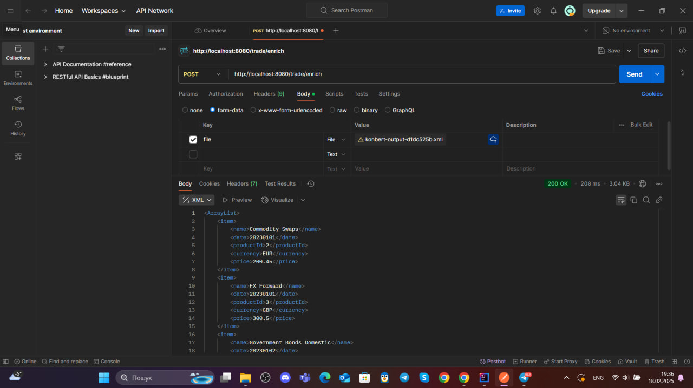
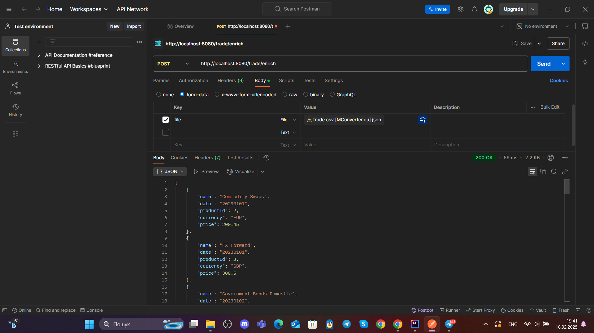

# TradeMapper
```bash
This service enriches trade data with product names based on a static product data file. 
It supports large datasets, performs data validation, logs missing product names, and 
ensures date format correctness. The service can be run as a Spring Boot application and
provides an API to handle CSV input.
```
## ✨ Features

- Exposes an API to enrich trade data with product names.
- Validates data and logs any issues (e.g., invalid dates, missing product names).
- Caches product name lookups to optimize performance using Redis.
- Caches results for repeated queries with Redis.
- Supports CSV input (and optionally JSON and XML).
- Optimized for large datasets with performance in mind.
- Uses the `Mono` class from the Reactor library for **reactive programming** and **asynchronous data processing**, allowing non-blocking data streams.
- Utilizes `Schedulers.parallel()` for **multi-threaded processing** of each trade in a separate thread, improving data processing efficiency (instead of using `CompletableFuture` or `Executor`).

## 🛠️ Technologies and Libraries Used

| Technology           | Version   |
|:---------------------|:----------|
| `JDK`                | `17`      |
| `Spring Boot`        | `3.3.1`   |
| `Maven`              | `4.0.0`   |
| `Lombok`             | `1.18.30` |
| `Redis`              | `3.2.1`   |
| `Reactor Test`       | `3.4.25`  |
| `Jackson`            | `1.18.30` |
| `Jakarta Annotation` | `2.1.1`   |
| `Apache Commons CSV` | `1.10.0`  |
| `Checkstyle plugin`  | `3.1.1`   |

## 🔒 Limitations

For testing purposes, the code currently limits the input data to **1 million rows**, and it processes this in approximately **2 minutes on a 4-core CPU**. These limitations can be removed in the `CsvLoader`, `JsonLoader`, or `XmlLoader` classes.

## 💡 Ideas for Improvement

1. Increase test coverage.
2. Improve response generation speed (using `StringBuilder` or multi-threading).
3. Implement a global exception handler with custom error messages.
4. Enhance validation by applying basic validation annotations on DTO fields and invoking `@Valid` in the controller.
5. Improve logging to both file and console.

## 💻 Testing

1. Download the code from GitHub using this [link](https://github.com/mrmax24/TradeMapper).
2. Open the project in IntelliJ IDEA.
3. Build the project using the command: `mvn clean install`.
4. Install Linux via PowerShell with the command: `wsl --install`.
5. Run Linux with the command: `wsl`, then update packages with `sudo apt update`.
6. Install Redis with `sudo apt install redis-server`, and start it with `sudo service redis-server status`.
7. Verify Redis is working with `redis-cli` and `ping`.
8. Run the program with: `app.trademapper.TradeMapperApplication`.
9. The easiest way to test is using Postman, with the URL `http://localhost:8080/trade/enrich` and selecting a file in form-data.
10. You can also test using this curl command: `curl -X POST -F "file=@src/main/resources/trade.csv" http://localhost:8080/trade/enrich`. For this upload your trade.csv file to /resources (I can't commit to Github file larger than 100 MB).
11. For quicker tests, I recommend placing test files with fewer rows in the `resources` folder.
12. Enjoy using the service!

## 📸 Screenshots
1.  
2. 
3. 
3. 
